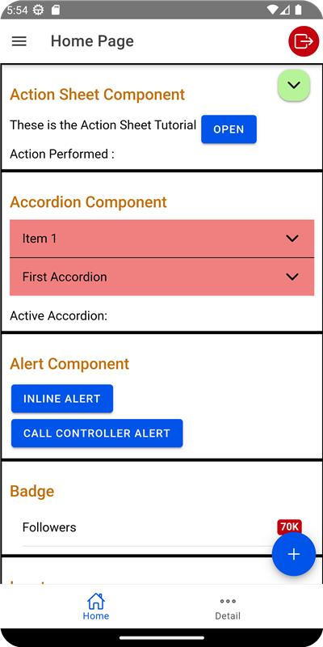
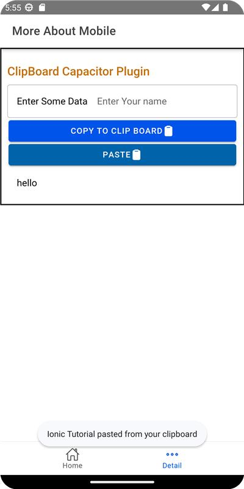
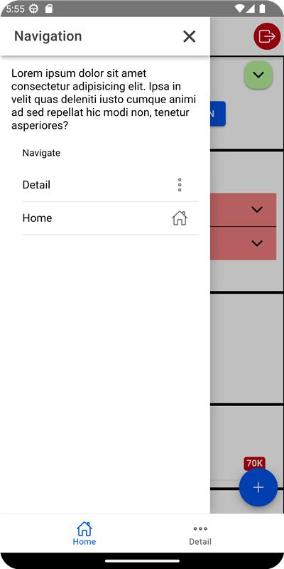
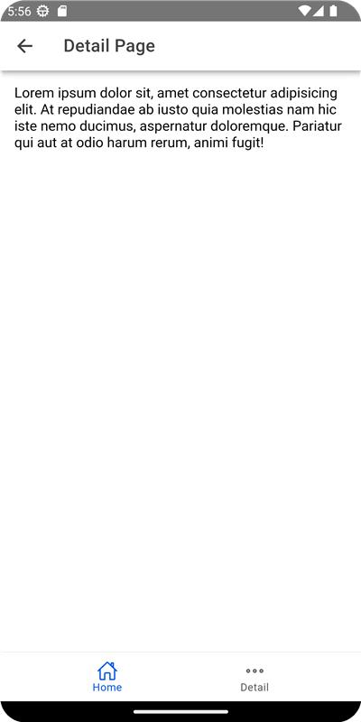

# Ionic Basics Tutorial

This tutorial covers only the basics of the Ionic Framework. Note that Ionic requires Angular.

Refer to the [Angular Tutorial](https://github.com/PrathameshDhande22/Web-Development-Tutorial/tree/main/AngularJS/Angular_Tutorial) to learn more about Angular.

## Contents

1. Creating an Ionic Project
2. Using and Creating Components in Ionic
3. Understanding the File and Folder Structure of an Ionic Project
4. Using Capacitor Plugins in the Ionic Framework
5. Creating a Signed APK

## Setup

1. Install the Node modules from the package:

   ```bash
   npm i
   ```

2. Download and install the Ionic CLI:

   ```bash
   npm i -g @ionic/cli
   ```

3. Start the Ionic server locally:

   ```bash
   ionic serve
   ```

Refer to the [Android Reference for Capacitor](https://capacitorjs.com/docs/android) for instructions on how to add the Android project to your current Ionic project and how to open it in Android Studio.

## Screenshots

**Component Usage Screenshot**  


**Capacitor Plugin Usage**  


**Drawer Component Usage**  


**New Page Component (Custom Component Creation)**  


## Notes: 
You can also refer to the [Notes](https://github.com/PrathameshDhande22/Android-Development-Tutorial/tree/ionic/Ionic-Tutorial/Notes)

## Sample

I have attached a sample of the Ionic app as a signed `.apk` file created through Android Studio. Give it a try!

[Sample App](https://github.com/PrathameshDhande22/Android-Development-Tutorial/releases/download/ionic/ionic-basics.apk)