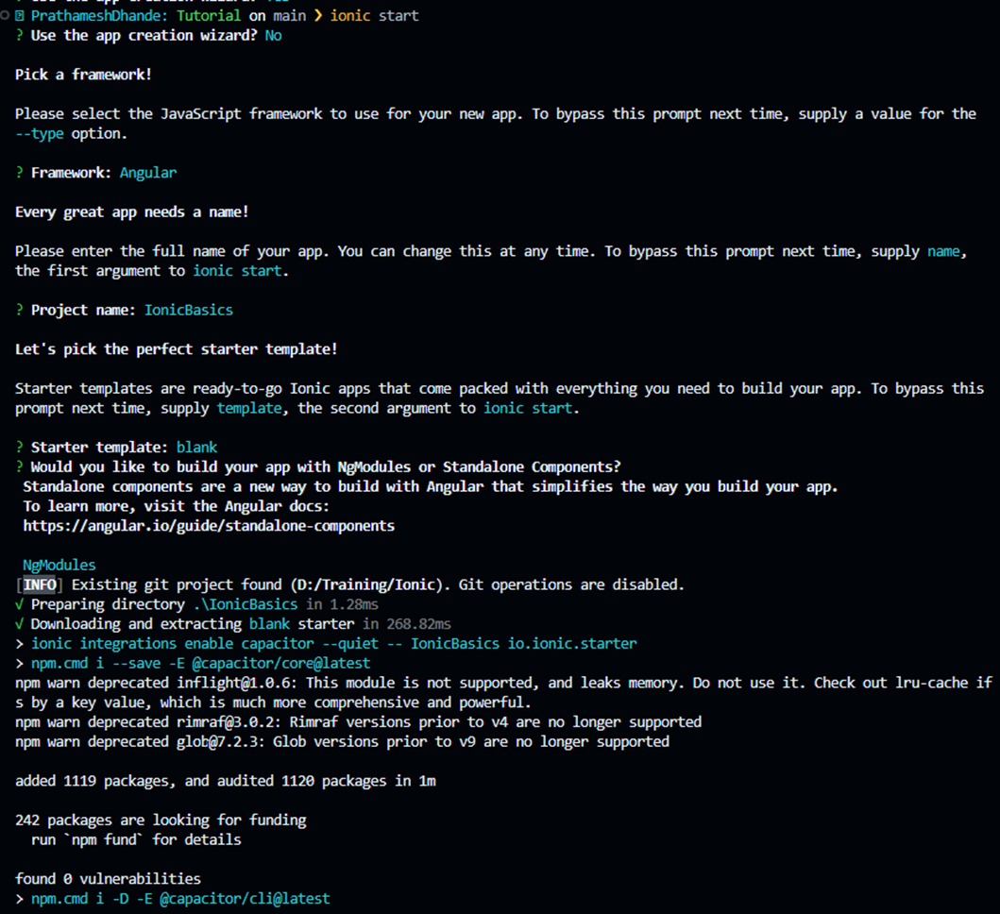
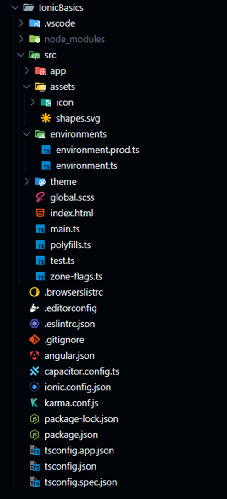
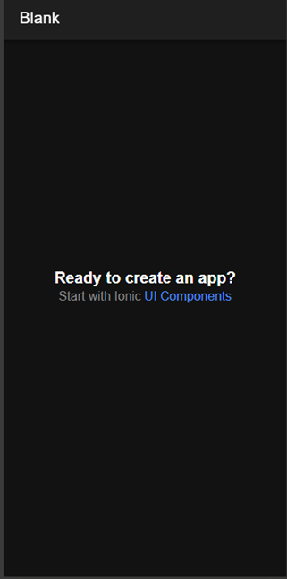

#  Ionic Tutorial        

Author: _Prathamesh Dhande_

## Contents

- [Ionic Framework](#ionic-framework)
  - [What is the Ionic Framework?](#what-is-the-ionic-framework)
  - [Ionic Framework Features](#ionic-framework-features)
- [Getting Started](#getting-started)
- [Creating the Ionic Application using CLI](#creating-the-ionic-application-using-cli)
- [Files and Folder Structure](#files-and-folder-structure)
- [Home Component Files Structure](#home-component-files-structure)
- [Running the Ionic Application for the First Time](#running-the-ionic-application-for-the-first-time)
- [UI Components](#ui-components)
- [Creating Custom Components/Pages/Services/Modules/Classes or Directives using Ionic CLI](#creating-custom-componentspagesservicesmodulesclasses-or-directives-using-ionic-cli)

---

## Ionic Framework

### What is the Ionic Framework?

Ionic Framework is an open-source UI toolkit for building performant, high-quality mobile apps, desktop apps, and progressive web apps using web technologies such as HTML, CSS, and JavaScript. It allows developers to build once and run everywhere. It was created by Max Lynch, Ben Sperry, and Adam Bradley of Drifty Co. in 2013, and the first beta version was released in March 2014.

The Ionic Framework mainly focuses on front-end user experience or UI interaction, handling the look and feel of your app. It is easy to learn and can integrate with other libraries or frameworks such as Angular and Cordova. It can also be used as a standalone solution with just a simple script include.

Officially, the Ionic Framework has integration with Angular.

### Ionic Framework Features:

- **Cross Platform**
- **Web Standards-Based**
- **Beautiful Design**
- **Simplicity**

The current latest version of Ionic as of December 2024 is **v8**. Although Ionic was initially created to build mobile apps with Angular only, after Ionic v4+ it integrated various frameworks like React and Vue.

While learning this tutorial, it is assumed that you have a **prerequisite** knowledge of Angular.

---

## Getting Started

Ionic apps are created and developed primarily through the Ionic command-line utility. The Ionic CLI is the preferred installation method as it offers a wide range of developer tools and help options along the way.

Install the Ionic CLI using the command:

```bash
npm install -g @ionic/cli
```

---

## Creating the Ionic Application using CLI

To create an Ionic application using Angular, run the command:

```bash
ionic start projectname --type=angular --capacitor
```

Alternatively, you can simply run:

```bash
ionic start
```

When you hit the command, the CLI will ask a set of questions on the terminal. This process will create the required files and folders for your project.

It will ask some set of questions on the Terminal which are shown in below image:


---

## Files and Folder Structure

These files and folders are generated when you first create a new project. Let's see what’s inside these files and folders:



### app.module.ts

```typescript
import { NgModule } from "@angular/core";
import { BrowserModule } from "@angular/platform-browser";
import { RouteReuseStrategy } from "@angular/router";

import { IonicModule, IonicRouteStrategy } from "@ionic/angular";

import { AppComponent } from "./app.component";
import { AppRoutingModule } from "./app-routing.module";

@NgModule({
  declarations: [AppComponent],
  imports: [BrowserModule, IonicModule.forRoot(), AppRoutingModule],
  providers: [{ provide: RouteReuseStrategy, useClass: IonicRouteStrategy }],
  bootstrap: [AppComponent],
})
export class AppModule {}
```

Here you can differentiate between pure Angular and Ionic. Notice that we are using the NgModule type from Angular. In later sections, we will learn about the standalone Angular project.

### app.component.html

```html
<ion-app>
  <ion-router-outlet></ion-router-outlet>
</ion-app>
```

Under the app folder, there is a home folder which contains the Home component.

---

## Home Component Files Structure

_The home folder contains the files for the Home component. (Details specific to the file structure can be expanded as needed.)_

---

## Running the Ionic Application for the First Time

To run the application, use the command:

```bash
ionic serve
```

This will launch your app in the default browser and display the initial page of your application.



---

## UI Components

In traditional web development, HTML inputs are used, but in Ionic you are encouraged to use Ionic’s prebuilt components that offer a consistent UI and improved user experience.

---

## Creating Custom Components/Pages/Services/Modules/Classes or Directives using Ionic CLI

You can generate custom components, pages, services, modules, classes, or directives using the following command:

```bash
ionic g component componentname
```

> [!NOTE]
> More Advanced Tutorial will be comming soon. Stay Tuned !
